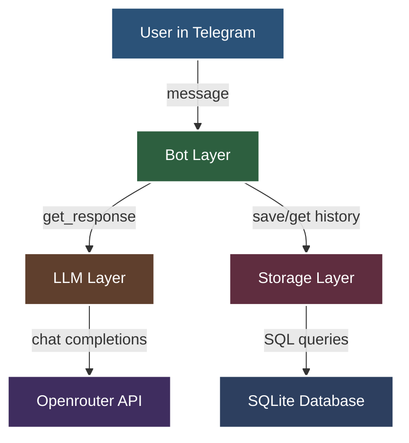
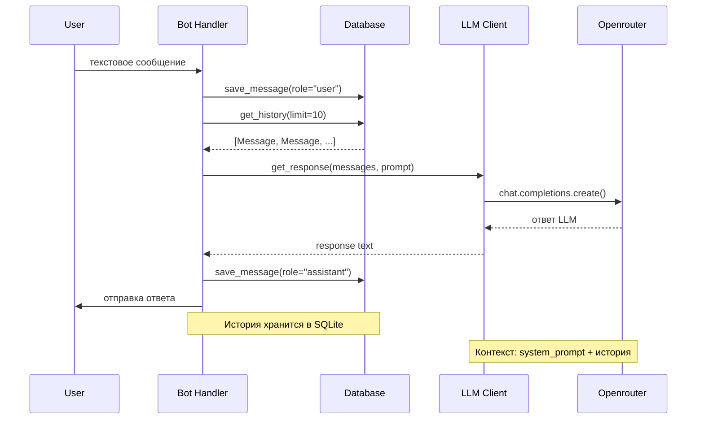
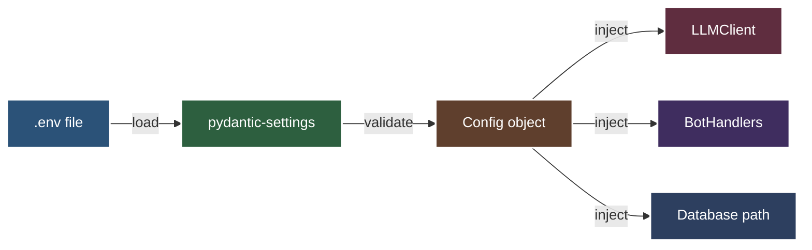
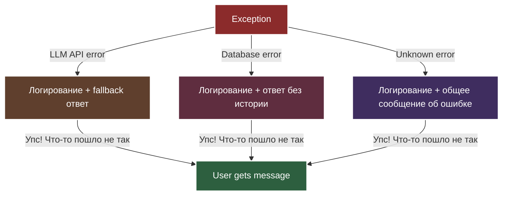

# Architecture - Архитектура и структура

Как устроен проект, основные концепции и модель данных.

---

## Слоистая архитектура

Проект построен по принципу **слоистой архитектуры** с четким разделением ответственности:



### Слои и их ответственность

| Слой | Модули | Ответственность |
|------|--------|----------------|
| **Bot Layer** | `bot/handlers.py`, `bot/bot.py` | Получение команд/сообщений, отправка ответов |
| **LLM Layer** | `llm/client.py` | Формирование промптов, запросы к LLM |
| **Storage Layer** | `storage/database.py`, `storage/models.py` | Сохранение/чтение истории диалогов |

**Правило зависимостей:** Bot → LLM → Storage (зависимости идут только вниз)

---

## Поток данных

Как обрабатывается сообщение пользователя:



**Этапы:**
1. Сообщение приходит в Bot Handler
2. Сохраняется в БД с `role="user"`
3. Загружается история (последние 10 сообщений)
4. Запрос к LLM с промптом + историей
5. Ответ сохраняется с `role="assistant"`
6. Ответ отправляется пользователю

---

## Ключевые принципы

### 1. Dependency Injection (DI)

Зависимости передаются через конструктор, не создаются внутри:

```python
class BotHandlers:
    def __init__(
        self,
        llm_client: LLMClientProtocol,  # ← DI
        database: DatabaseProtocol,     # ← DI
        config: Config,                 # ← DI
    ):
        self.llm_client = llm_client
        self.database = database
        self.config = config
```

**Преимущества:** тестируемость (легко подменить на mock), гибкость.

### 2. Protocol для абстракций

Используем `Protocol` вместо ABC для определения интерфейсов:

```python
# storage/protocols.py
class DatabaseProtocol(Protocol):
    async def save_message(self, message: Message) -> None: ...
    async def get_history(self, chat_id: int, user_id: int, limit: int) -> list[Message]: ...
```

**Преимущества:** structural subtyping (утиная типизация с проверкой типов).

### 3. Async-first

Все IO операции асинхронны:

```python
async def handle_message(self, message: TelegramMessage) -> None:
    await self.database.save_message(...)  # async
    history = await self.database.get_history(...)  # async
    response = await self.llm_client.get_response(...)  # async
```

**Преимущества:** эффективная обработка множественных запросов.

### 4. Connection Pool

Database использует единое соединение (переиспользуется):

```python
async with Database(path) as db:
    # Одно соединение на весь lifecycle бота
    await db.save_message(...)
    await db.get_history(...)
```

**Преимущества:** производительность, нет overhead создания соединений.

---

## Модель данных

### Таблица messages (SQLite)

```sql
CREATE TABLE messages (
    id INTEGER PRIMARY KEY AUTOINCREMENT,
    user_id INTEGER NOT NULL,
    chat_id INTEGER NOT NULL,
    role TEXT NOT NULL,           -- 'user' или 'assistant'
    content TEXT NOT NULL,
    created_at TIMESTAMP DEFAULT CURRENT_TIMESTAMP
);

CREATE INDEX idx_chat_user ON messages(chat_id, user_id, created_at DESC);
```

**Индекс `idx_chat_user`** - для быстрого поиска истории по паре (chat_id, user_id).

### Dataclass Message

```python
from dataclasses import dataclass
from datetime import datetime
from typing import Literal

@dataclass
class Message:
    user_id: int
    chat_id: int
    role: Literal["user", "assistant"]  # Типобезопасность
    content: str
    id: int | None = None
    created_at: datetime | None = None
```

**Literal для role** - mypy проверяет что используется только "user" или "assistant".

### Lifecycle сообщения


---

## Интеграции

### Telegram Bot API (aiogram)

```python
# bot/bot.py
bot = Bot(token=config.telegram_bot_token)
dp = Dispatcher()

# bot/handlers.py
@router.message(Command("start"))
async def cmd_start(message: TelegramMessage) -> None:
    await message.answer("Привет!")
```

**Режим:** polling (бот опрашивает сервер Telegram).

### Openrouter API (openai client)

```python
# llm/client.py
client = AsyncOpenAI(
    base_url="https://openrouter.ai/api/v1",
    api_key=config.openrouter_api_key,
)

response = await client.chat.completions.create(
    model=config.openrouter_model,
    messages=[
        {"role": "system", "content": system_prompt},
        {"role": "user", "content": "..."},
        {"role": "assistant", "content": "..."},
    ],
    temperature=0.8,
    max_tokens=1000,
)
```

**Модели:** бесплатные (gpt-oss-20b, deepseek-chat-v3.1, qwen3-coder, llama-3.3-8b).

### SQLite (aiosqlite)

```python
# storage/database.py
async with aiosqlite.connect(db_path) as conn:
    await conn.execute("INSERT INTO messages ...")
    await conn.commit()
```

**Файл БД:** `./data/messages.db` (создается автоматически).

---

## Управление конфигурацией



**Config класс (config.py):**
- Автоматическая загрузка из `.env`
- Валидация при старте (fail-fast)
- Типизация всех параметров
- Значения по умолчанию

---

## Управление историей

**Ограничение:** последние 10 сообщений (5 пар вопрос-ответ).

```python
history = await db.get_history(
    chat_id=chat_id,
    user_id=user_id,
    limit=10  # config.max_history_messages
)
```

**Сортировка:** от старых к новым (для корректного контекста LLM).

**Изоляция:** каждая пара (chat_id, user_id) имеет свою историю.

**Очистка:** команда `/reset` удаляет всю историю для пользователя.

---

## Обработка ошибок



**Логирование:** все ошибки записываются в лог с деталями.

**User experience:** пользователь получает дружелюбное сообщение.

---

## Почему такая архитектура?

**Преимущества текущего подхода:**

1. **Простота** - 3 слоя, понятные границы
2. **Тестируемость** - Protocol + DI = легко мокировать
3. **Расширяемость** - легко добавить новый слой или заменить интеграцию
4. **Производительность** - async + connection pool
5. **Надежность** - fail-fast валидация, явная обработка ошибок

**Что НЕ используется (осознанно):**
- ❌ Микросервисы (избыточно для MVP)
- ❌ Message queue (нет необходимости)
- ❌ Кеширование (SQLite достаточно быстр)
- ❌ Абстрактные фабрики (KISS)

---

## Дополнительные материалы

- **Визуализация проекта:** [visualization.md](visualization.md)
- **Детальное техническое видение:** [../vision.md](../vision.md)
- **Тур по коду:** [codebase_tour.md](codebase_tour.md)
- **Соглашения по коду:** [../../.cursor/rules/conventions.mdc](../../.cursor/rules/conventions.mdc)

