# Visualization - Визуализация проекта

Визуальное представление проекта с разных точек зрения.

---

## Архитектура системы

### Общая архитектура (слои)

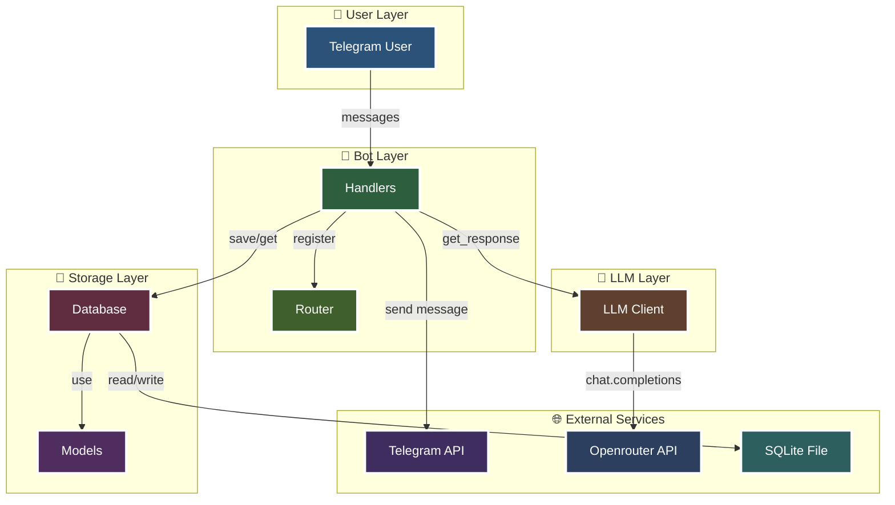
```mermaid
graph TB
    subgraph User["👤 User Layer"]
        U[Telegram User]
    end
    
    subgraph Bot["🤖 Bot Layer"]
        H[Handlers]
        R[Router]
    end
    
    subgraph LLM["🧠 LLM Layer"]
        LC[LLM Client]
    end
    
    subgraph Storage["💾 Storage Layer"]
        DB[Database]
        M[Models]
    end
    
    subgraph External["🌐 External Services"]
        TG[Telegram API]
        OR[Openrouter API]
        SQL[SQLite File]
    end
    
    U -->|messages| H
    H -->|register| R
    H -->|get_response| LC
    H -->|save/get| DB
    DB -->|use| M
    LC -->|chat.completions| OR
    H -->|send message| TG
    DB -->|read/write| SQL
    
    style U fill:#2b5278,stroke:#fff,stroke-width:3px,color:#fff
    style H fill:#2d5f3f,stroke:#fff,stroke-width:3px,color:#fff
    style R fill:#3f5f2d,stroke:#fff,stroke-width:3px,color:#fff
    style LC fill:#5f3f2d,stroke:#fff,stroke-width:3px,color:#fff
    style DB fill:#5f2d3f,stroke:#fff,stroke-width:3px,color:#fff
    style M fill:#4f2d5f,stroke:#fff,stroke-width:3px,color:#fff
    style TG fill:#3f2d5f,stroke:#fff,stroke-width:3px,color:#fff
    style OR fill:#2d3f5f,stroke:#fff,stroke-width:3px,color:#fff
    style SQL fill:#2d5f5f,stroke:#fff,stroke-width:3px,color:#fff
```

### Структура модулей

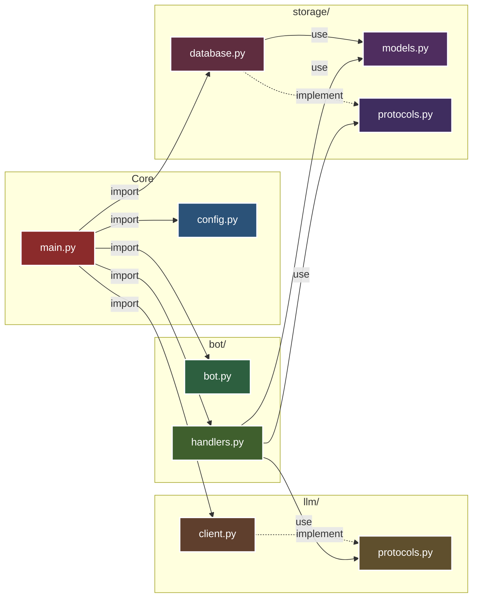
```mermaid
graph LR
    subgraph Core["Core"]
        Main[main.py]
        Config[config.py]
    end
    
    subgraph Bot["bot/"]
        BotPy[bot.py]
        Handlers[handlers.py]
    end
    
    subgraph LLM["llm/"]
        Client[client.py]
        LLMProto[protocols.py]
    end
    
    subgraph Storage["storage/"]
        Database[database.py]
        Models[models.py]
        StorProto[protocols.py]
    end
    
    Main -->|import| Config
    Main -->|import| BotPy
    Main -->|import| Handlers
    Main -->|import| Client
    Main -->|import| Database
    
    Handlers -->|use| LLMProto
    Handlers -->|use| StorProto
    Handlers -->|use| Models
    
    Client -.implement.-> LLMProto
    Database -.implement.-> StorProto
    Database -->|use| Models
    
    style Main fill:#8b2b2b,stroke:#fff,stroke-width:2px,color:#fff
    style Config fill:#2b5278,stroke:#fff,stroke-width:2px,color:#fff
    style BotPy fill:#2d5f3f,stroke:#fff,stroke-width:2px,color:#fff
    style Handlers fill:#3f5f2d,stroke:#fff,stroke-width:2px,color:#fff
    style Client fill:#5f3f2d,stroke:#fff,stroke-width:2px,color:#fff
    style LLMProto fill:#5f4f2d,stroke:#fff,stroke-width:2px,color:#fff
    style Database fill:#5f2d3f,stroke:#fff,stroke-width:2px,color:#fff
    style Models fill:#4f2d5f,stroke:#fff,stroke-width:2px,color:#fff
    style StorProto fill:#3f2d5f,stroke:#fff,stroke-width:2px,color:#fff
```

---

## Поток данных

### Обработка сообщения (последовательность)

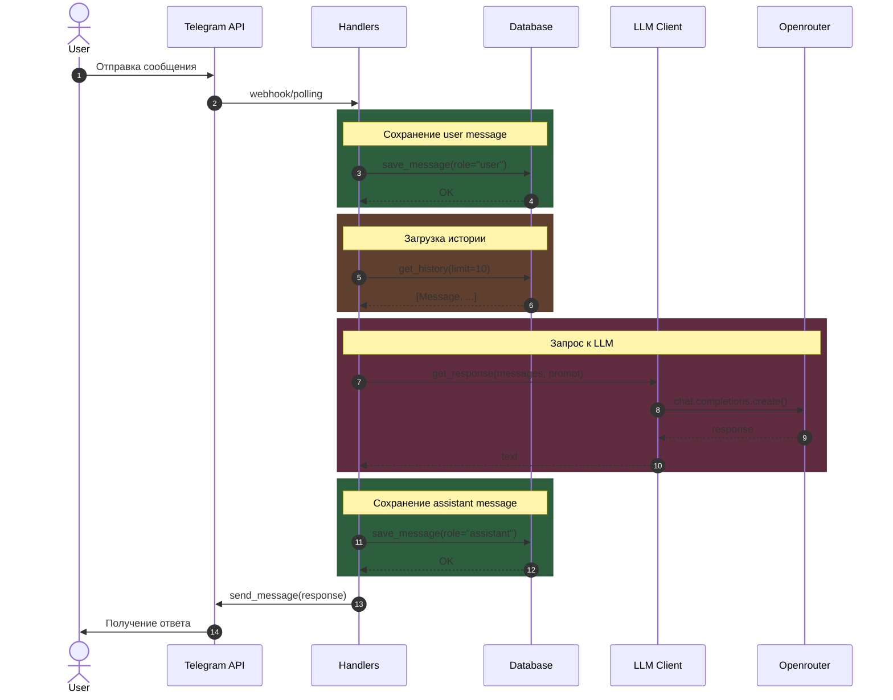
```mermaid
sequenceDiagram
    autonumber
    actor User
    participant TG as Telegram API
    participant H as Handlers
    participant DB as Database
    participant LLM as LLM Client
    participant OR as Openrouter
    
    User->>TG: Отправка сообщения
    TG->>H: webhook/polling
    
    rect rgb(45, 95, 63)
        Note over H,DB: Сохранение user message
        H->>DB: save_message(role="user")
        DB-->>H: OK
    end
    
    rect rgb(95, 63, 45)
        Note over H,DB: Загрузка истории
        H->>DB: get_history(limit=10)
        DB-->>H: [Message, ...]
    end
    
    rect rgb(95, 45, 63)
        Note over H,OR: Запрос к LLM
        H->>LLM: get_response(messages, prompt)
        LLM->>OR: chat.completions.create()
        OR-->>LLM: response
        LLM-->>H: text
    end
    
    rect rgb(45, 95, 63)
        Note over H,DB: Сохранение assistant message
        H->>DB: save_message(role="assistant")
        DB-->>H: OK
    end
    
    H->>TG: send_message(response)
    TG->>User: Получение ответа
```

### Жизненный цикл приложения

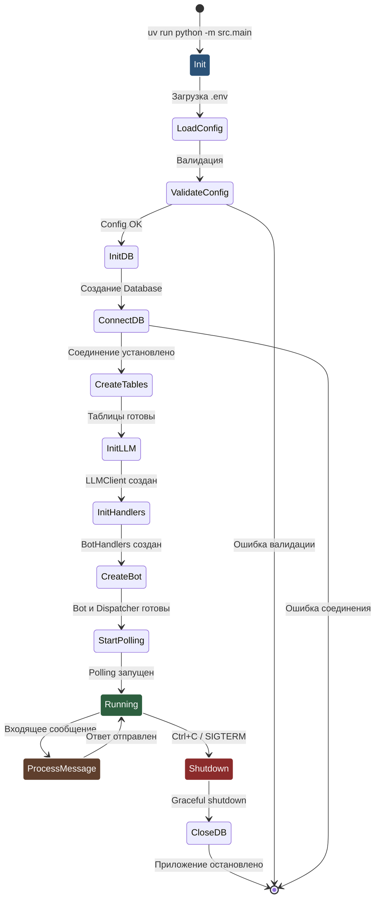
```mermaid
stateDiagram-v2
    [*] --> Init: uv run python -m src.main
    
    Init --> LoadConfig: Загрузка .env
    LoadConfig --> ValidateConfig: Валидация
    ValidateConfig --> InitDB: Config OK
    
    InitDB --> ConnectDB: Создание Database
    ConnectDB --> CreateTables: Соединение установлено
    CreateTables --> InitLLM: Таблицы готовы
    
    InitLLM --> InitHandlers: LLMClient создан
    InitHandlers --> CreateBot: BotHandlers создан
    CreateBot --> StartPolling: Bot и Dispatcher готовы
    
    StartPolling --> Running: Polling запущен
    
    Running --> ProcessMessage: Входящее сообщение
    ProcessMessage --> Running: Ответ отправлен
    
    Running --> Shutdown: Ctrl+C / SIGTERM
    Shutdown --> CloseDB: Graceful shutdown
    CloseDB --> [*]: Приложение остановлено
    
    ValidateConfig --> [*]: Ошибка валидации
    ConnectDB --> [*]: Ошибка соединения
    
    style Init fill:#2b5278,stroke:#fff,stroke-width:2px,color:#fff
    style Running fill:#2d5f3f,stroke:#fff,stroke-width:2px,color:#fff
    style ProcessMessage fill:#5f3f2d,stroke:#fff,stroke-width:2px,color:#fff
    style Shutdown fill:#8b2b2b,stroke:#fff,stroke-width:2px,color:#fff
```

---

## Структура данных

### Entity Relationship (База данных)

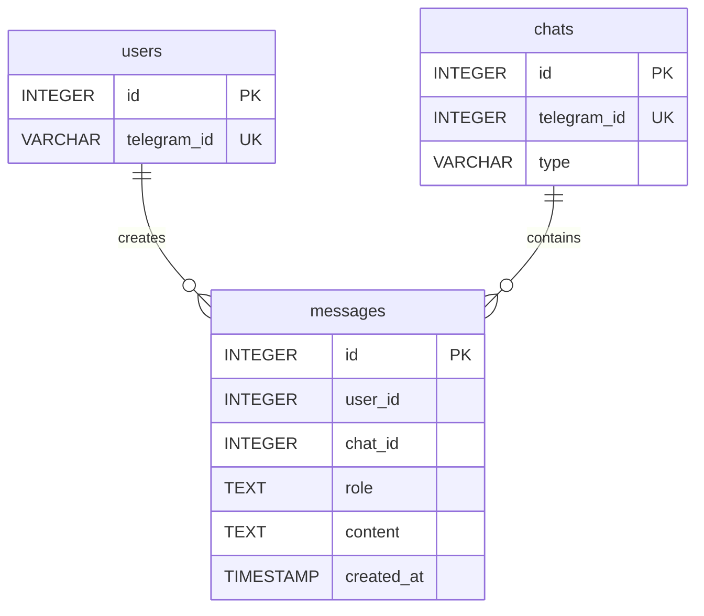
```mermaid
erDiagram
    messages {
        INTEGER id PK
        INTEGER user_id
        INTEGER chat_id
        TEXT role
        TEXT content
        TIMESTAMP created_at
    }
    
    users ||--o{ messages : creates
    chats ||--o{ messages : contains
    
    users {
        INTEGER id PK
        VARCHAR telegram_id UK
    }
    
    chats {
        INTEGER id PK
        INTEGER telegram_id UK
        VARCHAR type
    }
```

### Модель данных Message

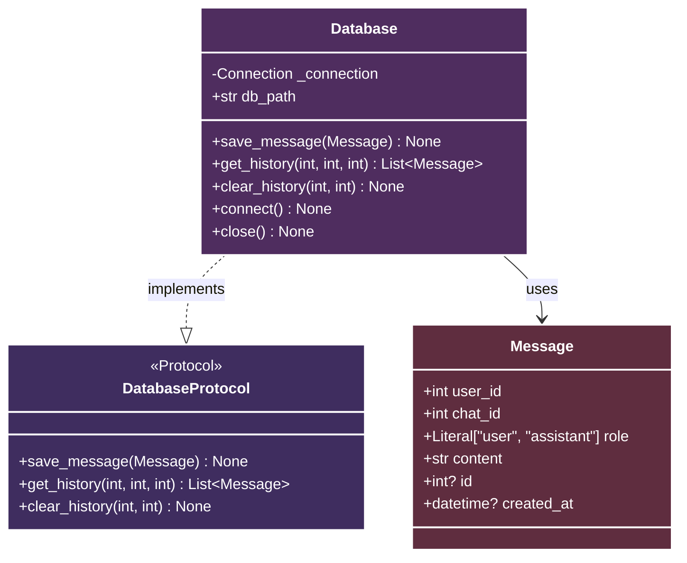
```mermaid
classDiagram
    class Message {
        +int user_id
        +int chat_id
        +Literal["user", "assistant"] role
        +str content
        +int? id
        +datetime? created_at
    }
    
    class Database {
        -Connection _connection
        +str db_path
        +save_message(Message) None
        +get_history(int, int, int) List~Message~
        +clear_history(int, int) None
        +connect() None
        +close() None
    }
    
    class DatabaseProtocol {
        <<Protocol>>
        +save_message(Message) None
        +get_history(int, int, int) List~Message~
        +clear_history(int, int) None
    }
    
    Database ..|> DatabaseProtocol : implements
    Database --> Message : uses
    
    style Message fill:#5f2d3f,stroke:#fff,stroke-width:2px,color:#fff
    style Database fill:#4f2d5f,stroke:#fff,stroke-width:2px,color:#fff
    style DatabaseProtocol fill:#3f2d5f,stroke:#fff,stroke-width:2px,color:#fff
```

---

## Взаимодействие компонентов

### Dependency Injection

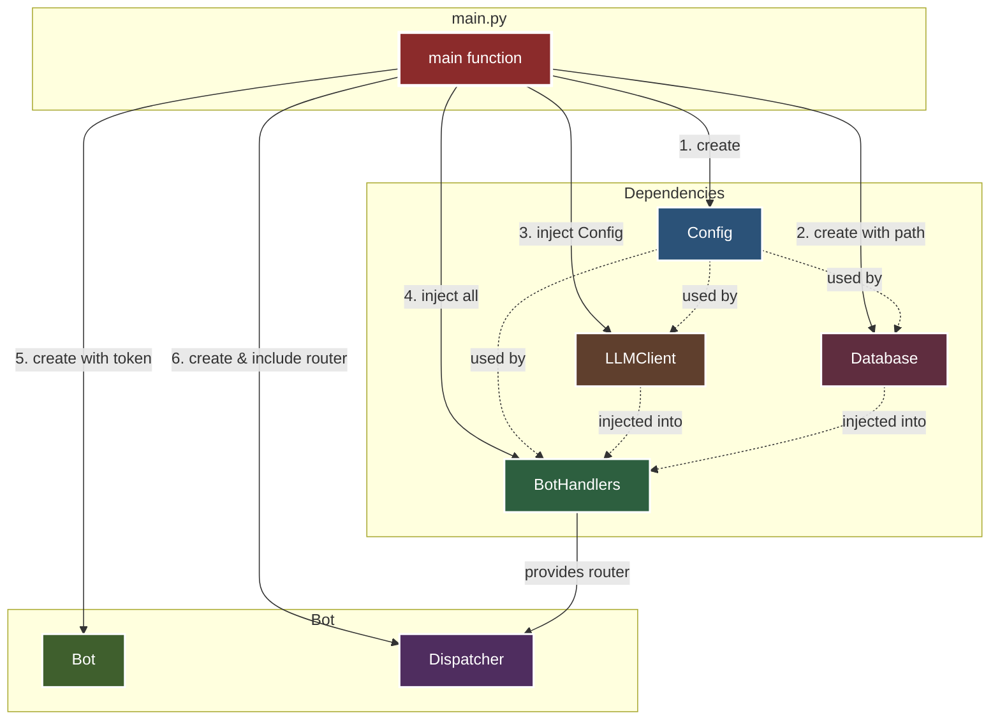
```mermaid
graph TD
    subgraph main.py
        Main[main function]
    end
    
    subgraph Dependencies
        Config[Config]
        DB[Database]
        LLM[LLMClient]
        Handlers[BotHandlers]
    end
    
    subgraph Bot
        BotObj[Bot]
        Dispatcher[Dispatcher]
    end
    
    Main -->|1. create| Config
    Main -->|2. create with path| DB
    Main -->|3. inject Config| LLM
    Main -->|4. inject all| Handlers
    Main -->|5. create with token| BotObj
    Main -->|6. create & include router| Dispatcher
    
    Config -.->|used by| DB
    Config -.->|used by| LLM
    Config -.->|used by| Handlers
    LLM -.->|injected into| Handlers
    DB -.->|injected into| Handlers
    
    Handlers -->|provides router| Dispatcher
    
    style Main fill:#8b2b2b,stroke:#fff,stroke-width:3px,color:#fff
    style Config fill:#2b5278,stroke:#fff,stroke-width:2px,color:#fff
    style DB fill:#5f2d3f,stroke:#fff,stroke-width:2px,color:#fff
    style LLM fill:#5f3f2d,stroke:#fff,stroke-width:2px,color:#fff
    style Handlers fill:#2d5f3f,stroke:#fff,stroke-width:2px,color:#fff
    style BotObj fill:#3f5f2d,stroke:#fff,stroke-width:2px,color:#fff
    style Dispatcher fill:#4f2d5f,stroke:#fff,stroke-width:2px,color:#fff
```

### Класс BotHandlers

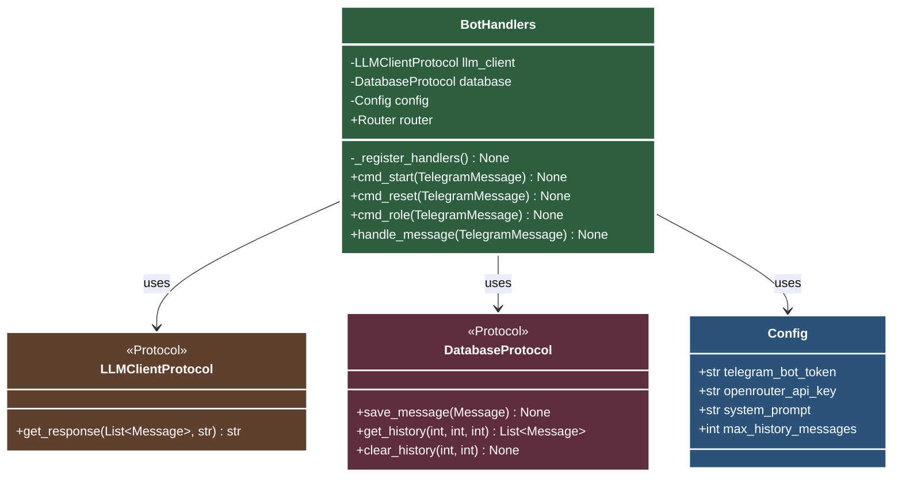
```mermaid
classDiagram
    class BotHandlers {
        -LLMClientProtocol llm_client
        -DatabaseProtocol database
        -Config config
        +Router router
        -_register_handlers() None
        +cmd_start(TelegramMessage) None
        +cmd_reset(TelegramMessage) None
        +cmd_role(TelegramMessage) None
        +handle_message(TelegramMessage) None
    }
    
    class LLMClientProtocol {
        <<Protocol>>
        +get_response(List~Message~, str) str
    }
    
    class DatabaseProtocol {
        <<Protocol>>
        +save_message(Message) None
        +get_history(int, int, int) List~Message~
        +clear_history(int, int) None
    }
    
    class Config {
        +str telegram_bot_token
        +str openrouter_api_key
        +str system_prompt
        +int max_history_messages
    }
    
    BotHandlers --> LLMClientProtocol : uses
    BotHandlers --> DatabaseProtocol : uses
    BotHandlers --> Config : uses
    
    style BotHandlers fill:#2d5f3f,stroke:#fff,stroke-width:3px,color:#fff
    style LLMClientProtocol fill:#5f3f2d,stroke:#fff,stroke-width:2px,color:#fff
    style DatabaseProtocol fill:#5f2d3f,stroke:#fff,stroke-width:2px,color:#fff
    style Config fill:#2b5278,stroke:#fff,stroke-width:2px,color:#fff
```

---

## Процессы разработки

### TDD Цикл

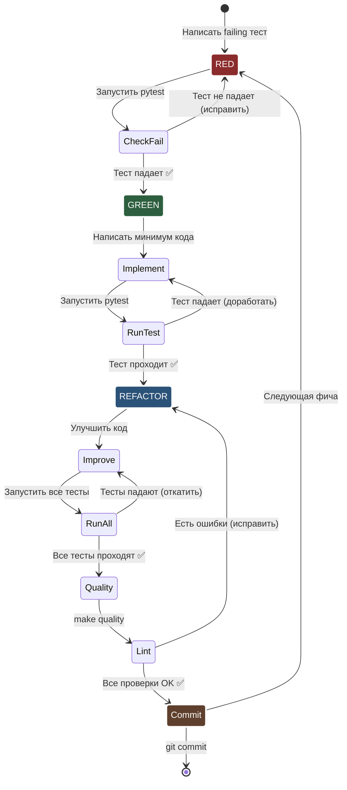
```mermaid
stateDiagram-v2
    [*] --> RED: Написать failing тест
    
    RED --> CheckFail: Запустить pytest
    CheckFail --> RED: Тест не падает (исправить)
    CheckFail --> GREEN: Тест падает ✅
    
    GREEN --> Implement: Написать минимум кода
    Implement --> RunTest: Запустить pytest
    RunTest --> Implement: Тест падает (доработать)
    RunTest --> REFACTOR: Тест проходит ✅
    
    REFACTOR --> Improve: Улучшить код
    Improve --> RunAll: Запустить все тесты
    RunAll --> Improve: Тесты падают (откатить)
    RunAll --> Quality: Все тесты проходят ✅
    
    Quality --> Lint: make quality
    Lint --> Commit: Все проверки OK ✅
    Lint --> REFACTOR: Есть ошибки (исправить)
    
    Commit --> [*]: git commit
    Commit --> RED: Следующая фича
    
    style RED fill:#8b2b2b,stroke:#fff,stroke-width:3px,color:#fff
    style GREEN fill:#2d5f3f,stroke:#fff,stroke-width:3px,color:#fff
    style REFACTOR fill:#2b5278,stroke:#fff,stroke-width:3px,color:#fff
    style Commit fill:#5f3f2d,stroke:#fff,stroke-width:3px,color:#fff
```

### Git Workflow

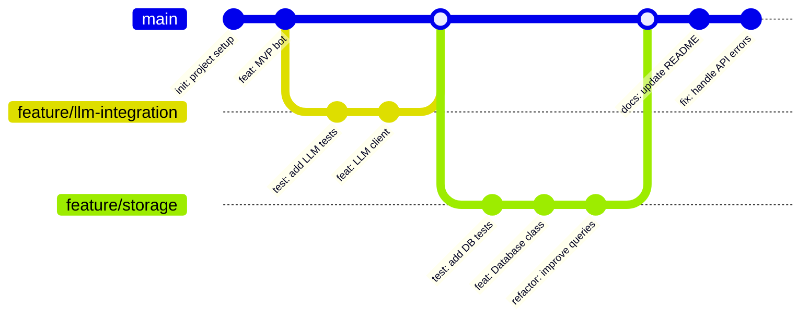
```mermaid
gitGraph
    commit id: "init: project setup"
    commit id: "feat: MVP bot"
    
    branch feature/llm-integration
    checkout feature/llm-integration
    commit id: "test: add LLM tests"
    commit id: "feat: LLM client"
    
    checkout main
    merge feature/llm-integration
    
    branch feature/storage
    checkout feature/storage
    commit id: "test: add DB tests"
    commit id: "feat: Database class"
    commit id: "refactor: improve queries"
    
    checkout main
    merge feature/storage
    
    commit id: "docs: update README"
    commit id: "fix: handle API errors"
```

---

## Обработка команд

### Роутинг команд

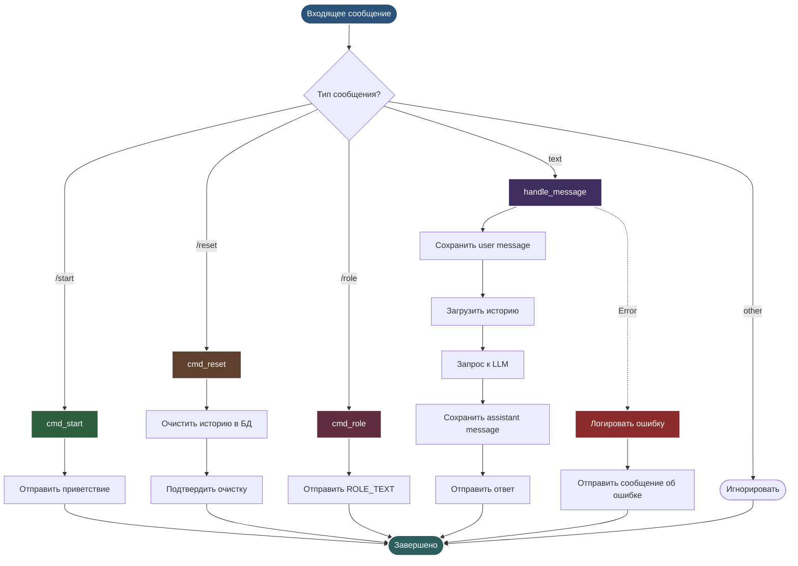
```mermaid
flowchart TD
    Start([Входящее сообщение]) --> Check{Тип сообщения?}
    
    Check -->|/start| CmdStart[cmd_start]
    Check -->|/reset| CmdReset[cmd_reset]
    Check -->|/role| CmdRole[cmd_role]
    Check -->|text| HandleMsg[handle_message]
    Check -->|other| Ignore([Игнорировать])
    
    CmdStart --> SendWelcome[Отправить приветствие]
    SendWelcome --> End([Завершено])
    
    CmdReset --> ClearDB[Очистить историю в БД]
    ClearDB --> SendConfirm[Подтвердить очистку]
    SendConfirm --> End
    
    CmdRole --> SendRole[Отправить ROLE_TEXT]
    SendRole --> End
    
    HandleMsg --> SaveUser[Сохранить user message]
    SaveUser --> LoadHistory[Загрузить историю]
    LoadHistory --> CallLLM[Запрос к LLM]
    CallLLM --> SaveAssistant[Сохранить assistant message]
    SaveAssistant --> SendReply[Отправить ответ]
    SendReply --> End
    
    HandleMsg -.Error.-> LogError[Логировать ошибку]
    LogError --> SendError[Отправить сообщение об ошибке]
    SendError --> End
    
    Ignore --> End
    
    style Start fill:#2b5278,stroke:#fff,stroke-width:2px,color:#fff
    style CmdStart fill:#2d5f3f,stroke:#fff,stroke-width:2px,color:#fff
    style CmdReset fill:#5f3f2d,stroke:#fff,stroke-width:2px,color:#fff
    style CmdRole fill:#5f2d3f,stroke:#fff,stroke-width:2px,color:#fff
    style HandleMsg fill:#3f2d5f,stroke:#fff,stroke-width:2px,color:#fff
    style LogError fill:#8b2b2b,stroke:#fff,stroke-width:2px,color:#fff
    style End fill:#2d5f5f,stroke:#fff,stroke-width:2px,color:#fff
```

### Формирование промпта для LLM

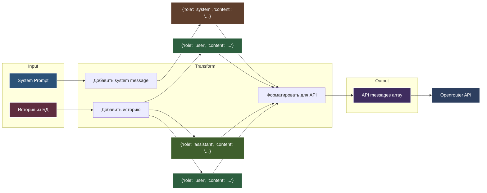
```mermaid
flowchart LR
    subgraph Input
        SysPrompt[System Prompt]
        History[История из БД]
    end
    
    subgraph Transform
        AddSystem[Добавить system message]
        AddHistory[Добавить историю]
        Format[Форматировать для API]
    end
    
    subgraph Output
        APIMessages[API messages array]
    end
    
    SysPrompt --> AddSystem
    AddSystem --> M1["{'role': 'system', 'content': '...'}"]
    
    History --> AddHistory
    AddHistory --> M2["{'role': 'user', 'content': '...'}"]
    AddHistory --> M3["{'role': 'assistant', 'content': '...'}"]
    AddHistory --> M4["{'role': 'user', 'content': '...'}"]
    
    M1 --> Format
    M2 --> Format
    M3 --> Format
    M4 --> Format
    
    Format --> APIMessages
    APIMessages --> OpenRouter[Openrouter API]
    
    style SysPrompt fill:#2b5278,stroke:#fff,stroke-width:2px,color:#fff
    style History fill:#5f2d3f,stroke:#fff,stroke-width:2px,color:#fff
    style M1 fill:#5f3f2d,stroke:#fff,stroke-width:2px,color:#fff
    style M2 fill:#2d5f3f,stroke:#fff,stroke-width:2px,color:#fff
    style M3 fill:#3f5f2d,stroke:#fff,stroke-width:2px,color:#fff
    style M4 fill:#2d5f3f,stroke:#fff,stroke-width:2px,color:#fff
    style APIMessages fill:#3f2d5f,stroke:#fff,stroke-width:2px,color:#fff
    style OpenRouter fill:#2d3f5f,stroke:#fff,stroke-width:2px,color:#fff
```

---

## Управление историей

### Ограничение истории (sliding window)

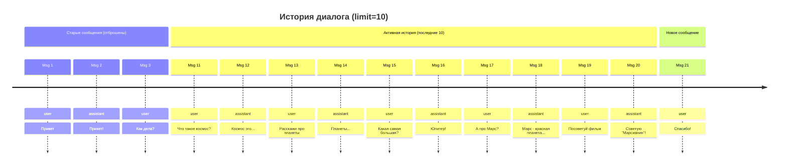
```mermaid
timeline
    title История диалога (limit=10)
    
    section Старые сообщения (отброшены)
        Msg 1 : user: Привет
        Msg 2 : assistant: Привет!
        Msg 3 : user: Как дела?
    
    section Активная история (последние 10)
        Msg 11 : user: Что такое космос?
        Msg 12 : assistant: Космос это...
        Msg 13 : user: Расскажи про планеты
        Msg 14 : assistant: Планеты...
        Msg 15 : user: Какая самая большая?
        Msg 16 : assistant: Юпитер!
        Msg 17 : user: А про Марс?
        Msg 18 : assistant: Марс - красная планета...
        Msg 19 : user: Посоветуй фильм
        Msg 20 : assistant: Советую "Марсианин"!
    
    section Новое сообщение
        Msg 21 : user: Спасибо!
```

### SQL Запрос истории

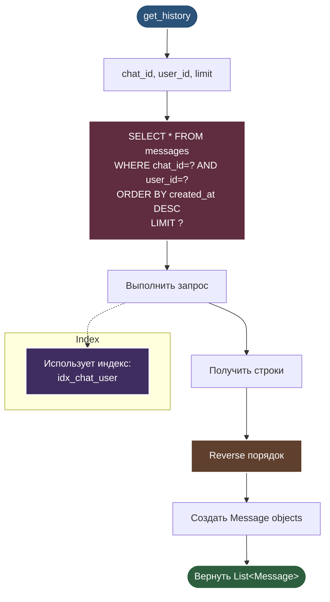
```mermaid
flowchart TD
    Start([get_history]) --> Params[chat_id, user_id, limit]
    
    Params --> Query["SELECT * FROM messages<br/>WHERE chat_id=? AND user_id=?<br/>ORDER BY created_at DESC<br/>LIMIT ?"]
    
    Query --> Execute[Выполнить запрос]
    Execute --> Fetch[Получить строки]
    Fetch --> Reverse[Reverse порядок]
    Reverse --> Hydrate[Создать Message objects]
    Hydrate --> Return([Вернуть List&lt;Message&gt;])
    
    subgraph Index
        IdxUse["Использует индекс:<br/>idx_chat_user"]
    end
    
    Execute -.-> IdxUse
    
    style Start fill:#2b5278,stroke:#fff,stroke-width:2px,color:#fff
    style Query fill:#5f2d3f,stroke:#fff,stroke-width:2px,color:#fff
    style Reverse fill:#5f3f2d,stroke:#fff,stroke-width:2px,color:#fff
    style Return fill:#2d5f3f,stroke:#fff,stroke-width:2px,color:#fff
    style IdxUse fill:#3f2d5f,stroke:#fff,stroke-width:2px,color:#fff
```

---

## Обработка ошибок

### Error Handling Flow

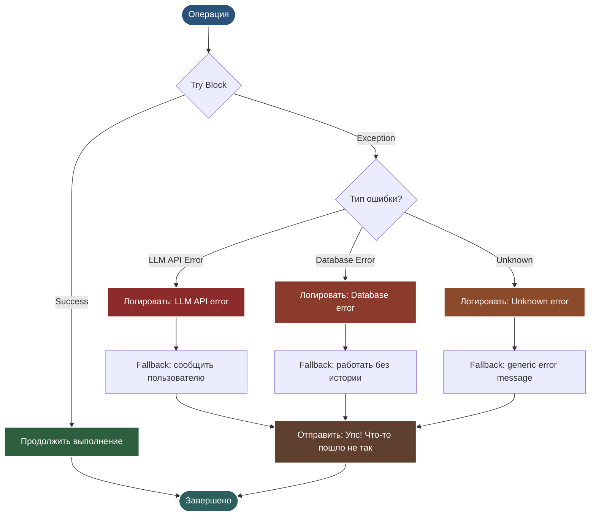
```mermaid
flowchart TD
    Start([Операция]) --> Try{Try Block}
    
    Try -->|Success| Success[Продолжить выполнение]
    Try -->|Exception| Catch{Тип ошибки?}
    
    Catch -->|LLM API Error| LLMError[Логировать: LLM API error]
    Catch -->|Database Error| DBError[Логировать: Database error]
    Catch -->|Unknown| UnknownError[Логировать: Unknown error]
    
    LLMError --> Fallback1[Fallback: сообщить пользователю]
    DBError --> Fallback2[Fallback: работать без истории]
    UnknownError --> Fallback3[Fallback: generic error message]
    
    Fallback1 --> UserMsg[Отправить: Упс! Что-то пошло не так]
    Fallback2 --> UserMsg
    Fallback3 --> UserMsg
    
    Success --> End([Завершено])
    UserMsg --> End
    
    style Start fill:#2b5278,stroke:#fff,stroke-width:2px,color:#fff
    style Success fill:#2d5f3f,stroke:#fff,stroke-width:2px,color:#fff
    style LLMError fill:#8b2b2b,stroke:#fff,stroke-width:2px,color:#fff
    style DBError fill:#8b3b2b,stroke:#fff,stroke-width:2px,color:#fff
    style UnknownError fill:#8b4b2b,stroke:#fff,stroke-width:2px,color:#fff
    style UserMsg fill:#5f3f2d,stroke:#fff,stroke-width:2px,color:#fff
    style End fill:#2d5f5f,stroke:#fff,stroke-width:2px,color:#fff
```

---

## Тестирование

### Структура тестов (по слоям)

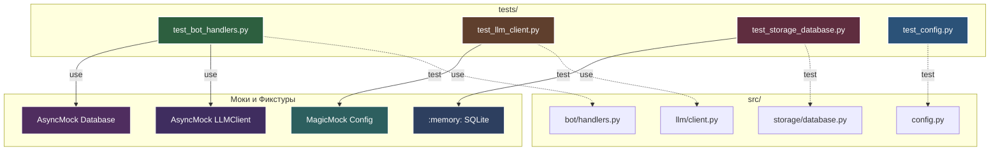
```mermaid
graph TB
    subgraph Tests["tests/"]
        TestBot[test_bot_handlers.py]
        TestLLM[test_llm_client.py]
        TestDB[test_storage_database.py]
        TestConfig[test_config.py]
    end
    
    subgraph Source["src/"]
        Bot[bot/handlers.py]
        LLM[llm/client.py]
        DB[storage/database.py]
        Config[config.py]
    end
    
    subgraph Mocks["Моки и Фикстуры"]
        MockLLM[AsyncMock LLMClient]
        MockDB[AsyncMock Database]
        InMemoryDB[":memory: SQLite"]
        MockConfig[MagicMock Config]
    end
    
    TestBot -.test.-> Bot
    TestBot -->|use| MockLLM
    TestBot -->|use| MockDB
    
    TestLLM -.test.-> LLM
    TestLLM -->|use| MockConfig
    
    TestDB -.test.-> DB
    TestDB -->|use| InMemoryDB
    
    TestConfig -.test.-> Config
    
    style TestBot fill:#2d5f3f,stroke:#fff,stroke-width:2px,color:#fff
    style TestLLM fill:#5f3f2d,stroke:#fff,stroke-width:2px,color:#fff
    style TestDB fill:#5f2d3f,stroke:#fff,stroke-width:2px,color:#fff
    style TestConfig fill:#2b5278,stroke:#fff,stroke-width:2px,color:#fff
    style MockLLM fill:#3f2d5f,stroke:#fff,stroke-width:1px,color:#fff
    style MockDB fill:#4f2d5f,stroke:#fff,stroke-width:1px,color:#fff
    style InMemoryDB fill:#2d3f5f,stroke:#fff,stroke-width:1px,color:#fff
    style MockConfig fill:#2d5f5f,stroke:#fff,stroke-width:1px,color:#fff
```

### Покрытие тестами

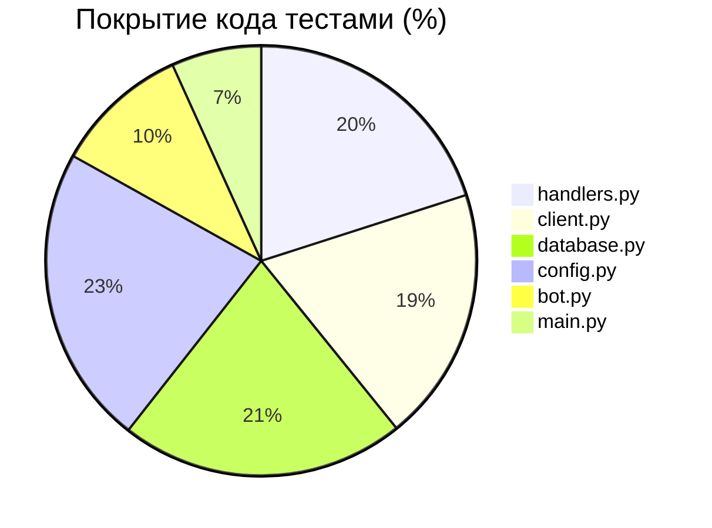
```mermaid
pie title Покрытие кода тестами (%)
    "handlers.py" : 89
    "client.py" : 85
    "database.py" : 95
    "config.py" : 100
    "bot.py" : 45
    "main.py" : 30
```

---

## Конфигурация

### Загрузка конфигурации

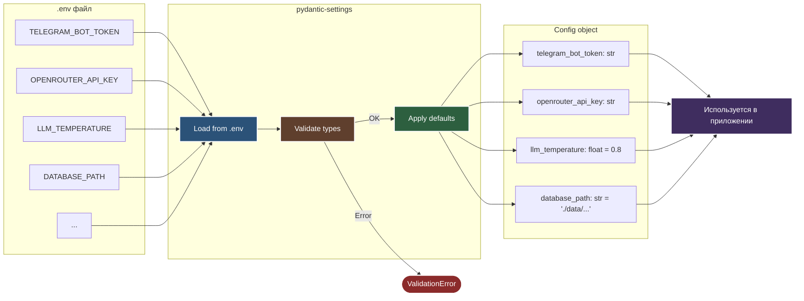
```mermaid
flowchart LR
    subgraph Env[".env файл"]
        V1[TELEGRAM_BOT_TOKEN]
        V2[OPENROUTER_API_KEY]
        V3[LLM_TEMPERATURE]
        V4[DATABASE_PATH]
        V5[...]
    end
    
    subgraph Pydantic["pydantic-settings"]
        Load[Load from .env]
        Validate[Validate types]
        Defaults[Apply defaults]
    end
    
    subgraph ConfigObj["Config object"]
        C1[telegram_bot_token: str]
        C2[openrouter_api_key: str]
        C3[llm_temperature: float = 0.8]
        C4[database_path: str = './data/...']
    end
    
    V1 --> Load
    V2 --> Load
    V3 --> Load
    V4 --> Load
    V5 --> Load
    
    Load --> Validate
    Validate -->|OK| Defaults
    Validate -->|Error| Error([ValidationError])
    
    Defaults --> C1
    Defaults --> C2
    Defaults --> C3
    Defaults --> C4
    
    C1 --> Use[Используется в приложении]
    C2 --> Use
    C3 --> Use
    C4 --> Use
    
    style Load fill:#2b5278,stroke:#fff,stroke-width:2px,color:#fff
    style Validate fill:#5f3f2d,stroke:#fff,stroke-width:2px,color:#fff
    style Defaults fill:#2d5f3f,stroke:#fff,stroke-width:2px,color:#fff
    style Error fill:#8b2b2b,stroke:#fff,stroke-width:2px,color:#fff
    style Use fill:#3f2d5f,stroke:#fff,stroke-width:2px,color:#fff
```

---

## Deployment

### Жизненный цикл в production

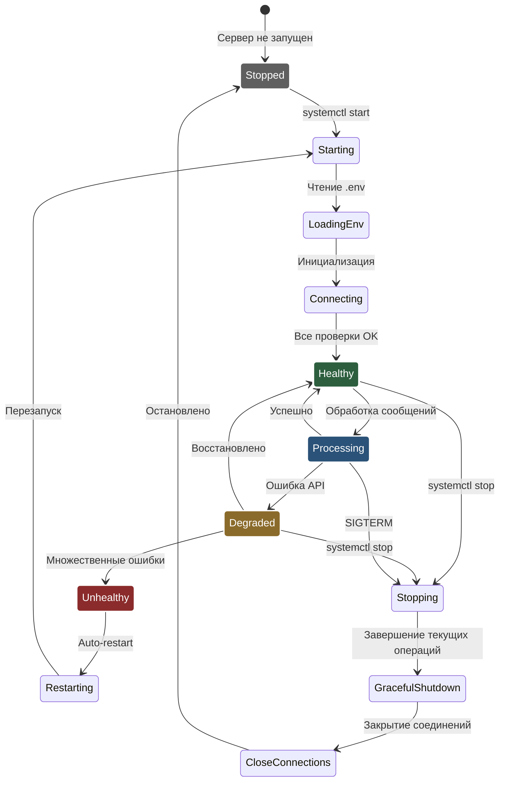
```mermaid
stateDiagram-v2
    [*] --> Stopped: Сервер не запущен
    
    Stopped --> Starting: systemctl start
    Starting --> LoadingEnv: Чтение .env
    LoadingEnv --> Connecting: Инициализация
    Connecting --> Healthy: Все проверки OK
    
    Healthy --> Processing: Обработка сообщений
    Processing --> Healthy: Успешно
    Processing --> Degraded: Ошибка API
    
    Degraded --> Healthy: Восстановлено
    Degraded --> Unhealthy: Множественные ошибки
    
    Unhealthy --> Restarting: Auto-restart
    Restarting --> Starting: Перезапуск
    
    Healthy --> Stopping: systemctl stop
    Degraded --> Stopping: systemctl stop
    Processing --> Stopping: SIGTERM
    
    Stopping --> GracefulShutdown: Завершение текущих операций
    GracefulShutdown --> CloseConnections: Закрытие соединений
    CloseConnections --> Stopped: Остановлено
    
    style Healthy fill:#2d5f3f,stroke:#fff,stroke-width:3px,color:#fff
    style Processing fill:#2b5278,stroke:#fff,stroke-width:2px,color:#fff
    style Degraded fill:#8b6b2b,stroke:#fff,stroke-width:2px,color:#fff
    style Unhealthy fill:#8b2b2b,stroke:#fff,stroke-width:2px,color:#fff
    style Stopped fill:#5f5f5f,stroke:#fff,stroke-width:2px,color:#fff
```

---

## Масштабирование

### Горизонтальное масштабирование (будущее)

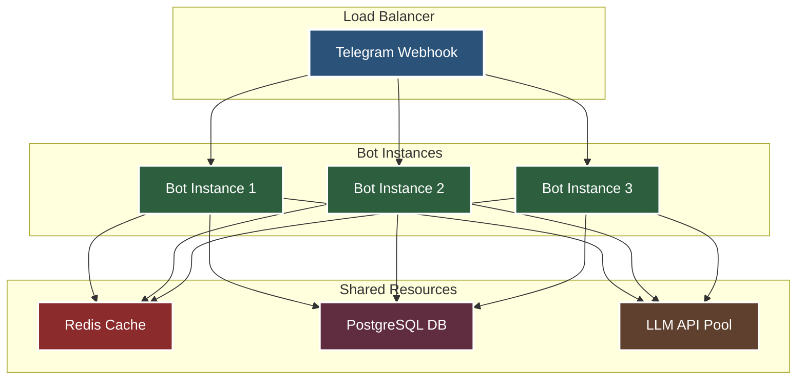
```mermaid
graph TB
    subgraph LB["Load Balancer"]
        Telegram[Telegram Webhook]
    end
    
    subgraph Instances["Bot Instances"]
        Bot1[Bot Instance 1]
        Bot2[Bot Instance 2]
        Bot3[Bot Instance 3]
    end
    
    subgraph Shared["Shared Resources"]
        Redis[Redis Cache]
        PostgreSQL[PostgreSQL DB]
        LLMPool[LLM API Pool]
    end
    
    Telegram --> Bot1
    Telegram --> Bot2
    Telegram --> Bot3
    
    Bot1 --> Redis
    Bot2 --> Redis
    Bot3 --> Redis
    
    Bot1 --> PostgreSQL
    Bot2 --> PostgreSQL
    Bot3 --> PostgreSQL
    
    Bot1 --> LLMPool
    Bot2 --> LLMPool
    Bot3 --> LLMPool
    
    style Telegram fill:#2b5278,stroke:#fff,stroke-width:3px,color:#fff
    style Bot1 fill:#2d5f3f,stroke:#fff,stroke-width:2px,color:#fff
    style Bot2 fill:#2d5f3f,stroke:#fff,stroke-width:2px,color:#fff
    style Bot3 fill:#2d5f3f,stroke:#fff,stroke-width:2px,color:#fff
    style Redis fill:#8b2b2b,stroke:#fff,stroke-width:2px,color:#fff
    style PostgreSQL fill:#5f2d3f,stroke:#fff,stroke-width:2px,color:#fff
    style LLMPool fill:#5f3f2d,stroke:#fff,stroke-width:2px,color:#fff
```

**Примечание:** Текущая версия использует polling и SQLite (single instance).

---

## Дополнительные материалы

- **Архитектура:** [architecture.md](architecture.md)
- **Тур по коду:** [codebase_tour.md](codebase_tour.md)
- **Процесс разработки:** [development_workflow.md](development_workflow.md)

